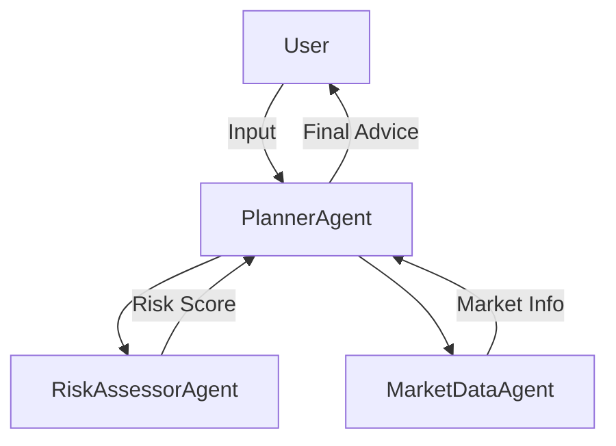

# 💰 FinAgentX

**FinAgentX** is an AI-powered autonomous financial planning advisor built using a multi-agent system. It provides real-time, personalized financial advice and investment portfolio management.

---

## 📦 Features Completed

| Feature                        | Status      |
| ----------------------------- | ----------- |
| Project Setup & Virtual Env   | ✅ Completed |
| Market Agent with Finnhub API | ✅ Completed |
| Planner Agent (Goal-Based)    | ✅ Completed |
| Modular Codebase              | ✅ Completed |
| CLI Test Script (`main.py`)   | ✅ Completed |
| Real-time Stock/Crypto Data   | ✅ Completed |

---

## 🧠 Architecture (WIP)



## Folder Structure : 
```
FinAgentX/
├── agents/
│   ├── market_agent.py
│   └── ...
├── core/
│   └── base.py (BaseAgent)
├── main.py
├── .env
├── README.md
└── requirements.txt
```

## Setup instructions : 
## 1. Clone the repo
```
git clone https://github.com/BaibhabKarmakar/FinAgentX.git
cd FinAgentX
```

## 2. Create and activate virtual environment
```
python3 -m venv venv
source venv/bin/activate
```

## 3. Install dependencies
```
pip install -r requirements.txt
```

## 4. Add your Finnhub API key to a .env file
```
echo "FINNHUB_API_KEY=your_key_here" > .env
```

## 5. Run
```
python main.py
```

## Author : 
Made with purpose and passion by Baibhab Karmakar 

